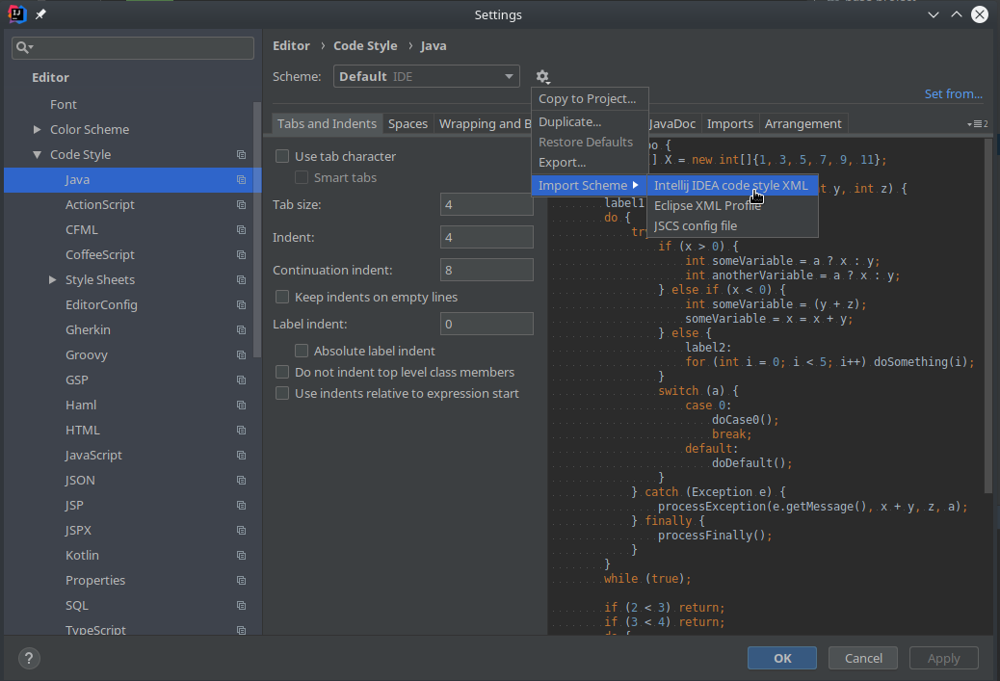

# Wissenstest (Praktikum zur Lehrveranstaltung Datenbanken 2)

Dieses Repository bildet die Grundlage für Ihr Praktikum in Datenbanken 2. Sie werden auf seiner Basis über das gesamte Semester verteilt in mehreren Schritten ein Wissensquiz entwickeln.
Zu diesem Zweck werden wir Git und GitLab einsetzten. Sollten Sie mehr Informationen und Hilfe zu den beiden Tools benötigen, klicken Sie bitte [hier](readme/gitandgitlab.md).

In diesem Dokument finden Sie die folgenden Informationen:

- [Fachliche Projektbeschreibung](#fachliche-projectbeschreibung)
- [Technische Projektbeschreibung](#technische-projektbeschreibung)
- [Hinweis zur Autorenschaft](#hinweis-zur-autorenschaft)

Hier finden Sie nun eine fachliche Projektbeschreibung des zu Implementierenden Spiels

# Fachliche Projektbeschreibung

## Projektidee

Ziel des Projekts ist die Entwicklung des Spiels „Wissenstest“, mit dem man sein Wissen in verschiedenen Wissensgebieten (Kategorien) testen kann.

## Datenbasis

Auf dem Datenbankserver werden zu unterschiedlichen Kategorien Fragen gespeichert.
Zu jeder Frage gibt es genau vier Antworten, von denen genau eine richtig ist und folglich drei falsch sind.

Jede Frage gehört zu genau einer Kategorie.

Eine Basis von Kategorien, Fragen und Antworten als Stammdaten wird in einer entsprechenden `csv`-Datei zur Verfügung gestellt. Die `csv`-Datei finden Sie im Unterordner `/src/main/resources/`. Sie trägt den Namen: `Wissenstest_sample200.csv`. Hier kann sie direkt gefunden werden: [Link](/src/main/resources/Wissenstest_sample200.csv)

## Spielbeschreibung

Wenn ein Spieler ein Spiel spielt, wählt er zunächst eine beliebige Anzahl von Kategorien aus (mindestens zwei) und lässt sich hierzu zufällig eine maximale Anzahl von Fragen generieren. Diese maximale Anzahl der Fragen pro Kategorie wird pro Spiel zu Beginn ebenfalls festgelegt und ist dann für alle Kategorien innerhalb eines Spiels gleich.
Aus den angebotenen vier Antworten muss der Spieler genau eine auswählen – er bekommt sofort eine Auskunft darüber, ob die ausgewählte Antwort richtig oder falsch war.
Sehen Sie für jedes Spiel die folgenden Informationen vor:

- Spieler
- Timestamp Start, Timestamp Ende
- Liste der Kategorien, Liste der Fragen und ausgewählte Antwort

Von jedem Spieler sollte (mindestens) der eindeutige Spielername gespeichert sein.

**Hinweis**: Wollen Sie weitere Attribute vorsehen, sprechen Sie dies mit Ihrem Praktikumsbetreuer ab, da diese in Konflikt mit Abfragen aus Praktikum 5 stehen könnten.

## Auswertung

Haben mehrere Spieler das Spiel gespielt, so gibt es die Möglichkeit, Analysen unterschiedlichster Art zu einem oder mehreren Spielern aufzurufen. Welche Analysemöglichkeiten implementiert werden, ist Bestandteil des Praktikums 5.

# Technische Projektbeschreibung

## Projektrahmen

Im diesem Repository finden Sie einen Projektrahmen, den Sie für die Implementierung des gesamten Projektes verwenden sollen. Unter anderem bringt er eine Package-Struktur mit, in die Sie Ihren Code einfügen sollen. Konkret heißt dies, dass alle von Ihnen erzeugten Klassen in `de.hda.fbi.db2.stud` oder von ihnen erstellte Unterordner in dem Package zu erstellen sind.

Viele Teile des eigentlichen Wissenstests als Spiel sind bereits vorgegeben, beziehungsweise implementiert. Schauen Sie sich die abstrakten Klassen in dem Package `de.hda.fbi.db2.api` an. Ihre Aufgabe besteht darin für jedes Praktikum eine Implementierung (Unterklasse) für diese zur Verfügung zu stellen. Ihre Implementierung muss innerhalb oder unterhalb des Packages `de.hda.fbi.db2.stud` sein. Lesen Sie sich genaustens die JavaDoc Kommentare in den abstrakten Klassen durch.
In der Klasse `Main`, müssen Sie für jeweilige Praktika gegebenenfalls Codezeilen aus- beziehungsweise einkommentieren.

Darüber hinaus, bringt der Projektrahmen noch die folgenden Dinge mit:

- Gradle Projekt: Fertiges Projekt, damit Sie direkt mit der Entwicklung anfangen können. Weitere Informationen zu Gradle finden Sie [hier](https://gradle.org/)
- Vorbereitete JPA Ressourcen (z.B. `persistance.xml`)
- Datenbasis als `csv`-Datei. Die Datei finden Sie im Unterordner `/src/main/resources/Wissenstest_sample200.csv`
- Parser für die Datenbasis. Sie finden diesen im Package: `de.hda.fbi.db2.controller.CsvDataReader`
- CI/CD Pipeline (details siehe unten) zum Bauen und Testen Ihres Projektes auf dem GitLab Server

Weitere Hinweise wie sie das Projekt bei sich Lokal clonen und in IntelliJ verwenden finden sie [hier](readme/gitandgitlab.md)

## Benötigte Software für die Arbeit mit Git bzw. GitLab

Sie benötigen für dieses Praktikum die [IDE IntelliJ](https://www.jetbrains.com/idea/) mit [Gradle-Plugin](https://docs.gradle.org/current/userguide/idea_plugin.html) (automatisch Teil von IntelliJ) und JDK11

- Für IntelliJ ist **vorab** eine kostenlose Registrierung als Student notwendig.
- Andere IDEs sind möglich, werden im Praktikum aber nicht unterstützt.

Wir empfehlen, zusätzlich zum in IntelliJ integrierten Git-Client die Software TortoiseGIT zu installieren:

- Unter Windows: [TortoiseGIT](https://tortoisegit.org/) integriert sich in den Windows-Explorer, sodass alle Funktionen im Explorer über das Kontextmenü (rechte Maustaste) aufrufbar sind. Zur Nutzung von TortoiseGIT benötigen Sie außerdem GitForWindows.
- Falls Sie Linux verwenden, installieren Sie ein git package Ihrer Wahl. Aber, ganz ehrlich, wenn Sie Linux verwenden, wissen Sie genau was zu tun ist.

## Continuous Integration Pipeline

Der GitLab-Server führt automatisch Builds und Tests Ihrer Commits durch. Damit können Sie und wir schon im Vorfeld prüfen, ob Ihr aktueller Stand den Anforderungen entspricht.
Wie oben beschrieben, setzen wir dabei voraus, dass Sie Ihr Projekt in dem von uns vorgesehenem Package entwickeln: `de.hda.fbi.db2.stud`. Wenn Sie sich nicht an diese Anforderung halten, erhalten Sie kein Testat! Den Stand Ihrer Builds und Tests können Sie links in Ihrem Repository über das Menu "CI/CD" &rarr; "Pipelines" abrufen.

Die Pipeline verwendet die folgenden zwei Tools:

- [Checkstyle](http://checkstyle.sourceforge.net/) ist ein Werkzeug zur statischen Code-Analyse zur Prüfung des Programmierstils von Java-Sourcecode. Konkret verwenden wir im Praktikum Google's Java Code Style. Eine Beschreibung können Sie [hier](https://google.github.io/styleguide/javaguide.html) bzw. [hier](http://checkstyle.sourceforge.net/google_style.html) finden.
- [Spotbugs](https://spotbugs.github.io/) such in Java-Programmen nach Fehlermustern. Solche Fehlermuster deuten oft auf tatsächliche Fehler hin.

## Nutzen der Checkstyle und Spotbugs in IntelliJ

Bevor Sie ihren Code zum GitLab-Server pushen, sollten Sie local mit Hilfe von Spotbugs und Checkstyle überprüfen lassen ob die Pipeline Fehler finden wird. Dafür rufen Sie einfach in IntelliJ den Gradle task `build` auf. In der Konsolenausgabe werden entsprechende Fehler angezeigt.

Erzeugte Reports finden Sie lokal im Projekt unter `/build/reports/`.

## Konfiguration von IntelliJ zur Verwendung des Google Style Checker

IntelliJ verwendet standardmäßig im Editor für Style Checking **nicht** Google's Java Code Style. Dies sollten Sie manuell konfigurieren. Sie tun dies, indem Sie die Einstellungen von IntelliJ öffnen (File &rarr; Settings &rarr; Editor &rarr; Code Style) und wählen bei Import Schema (siehe Screenshot)
Sie finden die nötige Datei im Projektordner unter: `/readme/intellij-java-google-style.xml`

# Hinweis zur Autorenschaft

Dieses Projekt wurde durch die Mitglieder der [Fachgruppe Datenbanken](https://fbi.h-da.de/fachbereich/fachgruppen/datenbanken/) gemeinsam entwickelt und seitdem gepflegt.
